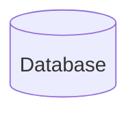

# Umbrella
- All Infrastructure for NJITACM

## :blue_book: Technical Details
- [Wiki](https://github.com/njitacm/umbrella/wiki)

## :microscope: Technologies
- Infrastructure: `gcp - google cloud platform`
- Tools: `wazuh`, `misp`, `sysdig`, `cortex`, `zeek`, `TheHive`, `elastic`, `graylog`, `sigma`
- Technologies: `Terraform`, `Ansible`, `Kubernetes`

## :hammer: How to Build

## :alembic: Usage

## :triangular_ruler: Architecture




## :card_file_box: Directory Explanation

```s

```

---

- [Advanced Github Usage](https://docs.github.com/en/get-started/writing-on-github/working-with-advanced-formatting/creating-diagrams)
- [Gitemojis for commiting](https://gitmoji.dev/)
- [Mermaid Syntax](https://mermaid-js.github.io/mermaid/#/)
